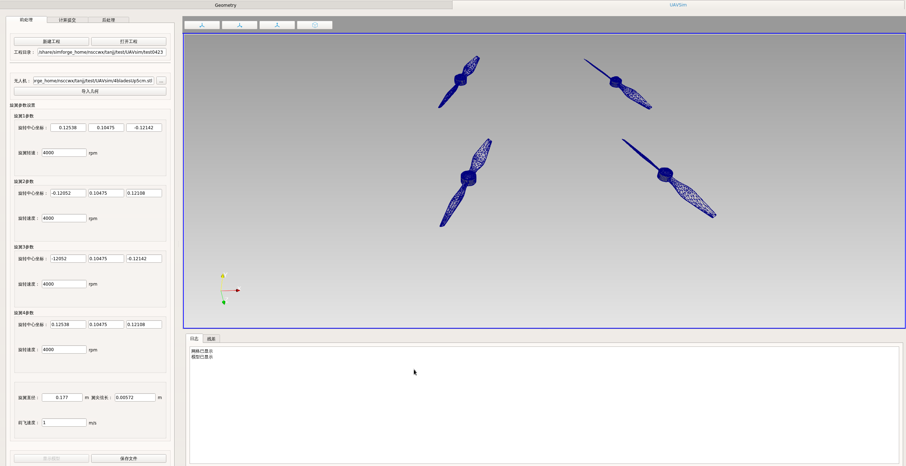
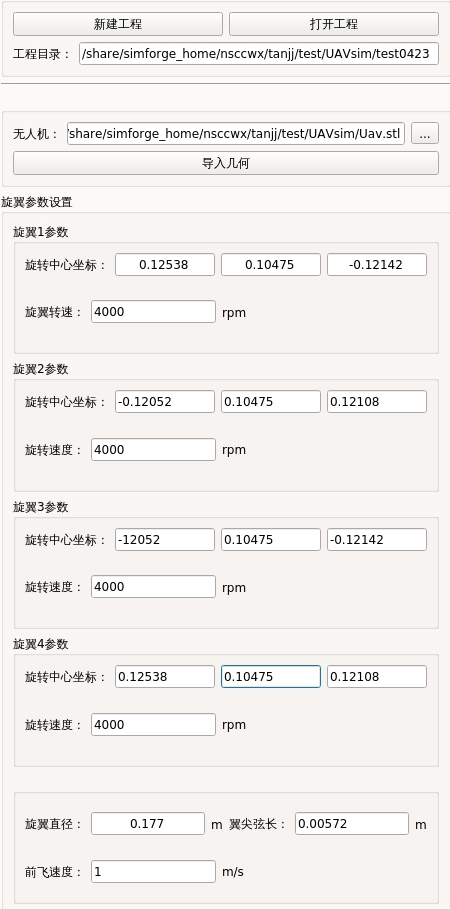
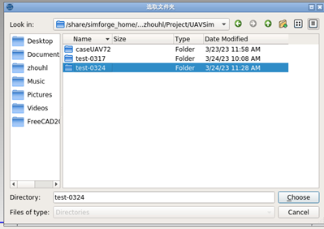
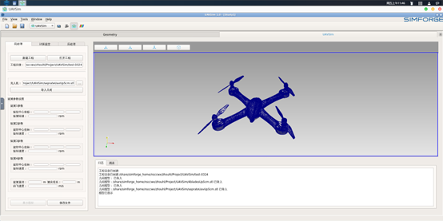
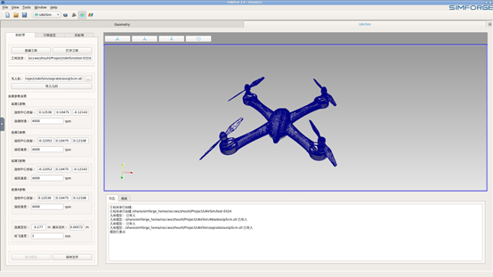
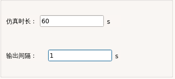
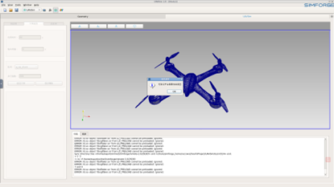
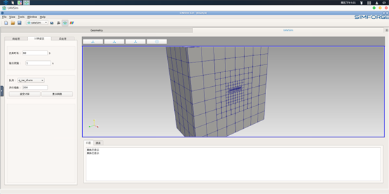
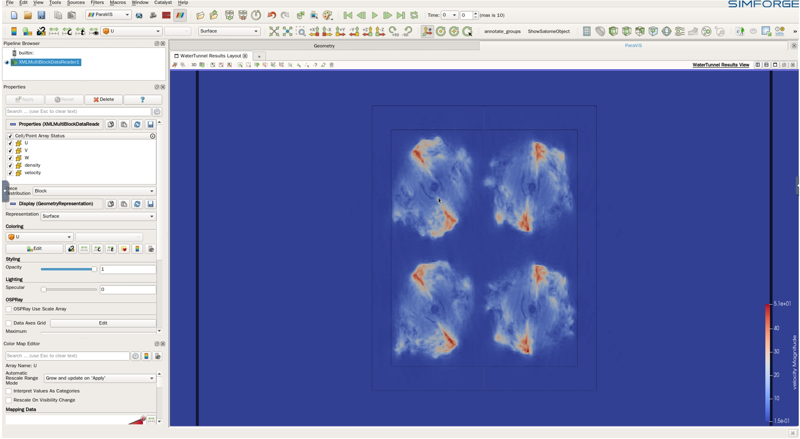

# 标杆案例细化—无人机仿真APP

## 1. 客户需求概述
无人机广泛应用于军事侦察、民用航拍、物流配送、农业植保、应急救援等诸多领域，其市场规模呈现出爆发式增长态势。随着应用场景的不断拓展和深化，对无人机的性能、可靠性和安全性提出了越来越高的要求，这使得无人机的研发设计面临着前所未有的挑战。

无人机是一个高度复杂的系统，涉及空气动力学、机械工程、电子信息、自动控制等多个学科领域的知识融合。在空气动力学方面，精确模拟无人机在不同飞行状态下的气流特性是确保飞行性能的关键。然而，气流与无人机机体及旋翼之间的相互作用极为复杂，受到飞行姿态、速度、环境风等多种因素的影响，准确建模和分析难度极大。在研发流程中，传统的设计方法主要依赖实物试验和经验积累。但实物试验成本高昂且耗时费力。此外，经验设计在面对新型无人机的创新设计需求时，缺乏科学依据和理论支持，难以快速准确地确定最优设计方案，导致研发周期延长。

针对以上问题，我们基于"神工坊"前后处理集成框架，研发出了一款名为UAVSim的无人机仿真APP，其深度集成了自研的结构网格自适应框架（SAMR）以及格子玻尔兹曼方法（LBM），在本期文章中，对此无人机仿真设计UAVSim APP进行介绍。

## 2. 解决方案
### 2.1 自研网格模块生成自适应网格
#### 2.1.1 需求
无人机在不同的飞行任务和工况下，对网格的要求差异显著。例如，在执行高速飞行任务时，无人机表面气流变化剧烈，尤其是机翼、旋翼等关键部位，需要精细的网格来精确捕捉气流的细微变化，从而准确计算空气动力特性；而在低速飞行或悬停状态下，气流相对稳定，过于精细的网格会导致计算资源的浪费，增加计算时间和成本。同时，不同类型的无人机（如固定翼、多旋翼等）其几何形状和结构特点各异，也需要与之相适应的网格划分。此外，随着无人机飞行环境的变化（如从开阔空域进入复杂地形区域），气流情况变得复杂多样，网格需要能够动态调整以适应这些变化，确保仿真结果的准确性。
#### 2.1.2 方案 
UAVSim 的网络模块基于自研的结构网格自适应技术（SAMR）来生成自适应网格，其具有以下几点优势：
- 网格自动生成：SAMR 技术主要基于笛卡尔网格，其网格结构相对简单，天然适合自动生成网格。即使面对复杂的无人机几何形状或存在一定几何缺陷（如轻微不平整、小空洞等）的模型，也能通过适当处理成功生成网格。例如，对于多旋翼无人机复杂的旋翼结构和机身连接部分，模块可以自动识别并生成合适的网格。在边界处，采用脱体网格加密和合适的边界模型（如浸没边界法），确保边界条件的准确性，有效提高了网格生成的效率和质量，降低了对人工前处理的依赖。
- 高效自适应加密：SAMR 技术可以使网格能够精准地集中在需要加密的关键区域。在无人机飞行过程中，根据实时监测的物理场特征（如气流速度、压力变化等），在气流变化剧烈的区域（如高速飞行时的机翼前缘、旋翼旋转区域等）快速加密网格，而在相对稳定的区域则保持较粗的网格，从而高效利用网格资源。与传统结构化网格相比，它无需按固定维度进行加密，更加灵活；相较于非结构网格，在保持局部结构化优势的同时，利用简单直接的等分和合并规则实现网格重构，速度更快、效率更高。例如，当无人机从平稳飞行进入紊流区域时，网格能迅速在紊流影响区域加密，准确捕捉气流变化，可见下图。

- 多尺度特征捕捉与计算效率提升：SAMR 技术能够有效捕捉无人机飞行中的多尺度特征。无论是大尺度的气流整体分布，还是小尺度的涡旋、边界层等细节，都能通过自适应加密得到准确模拟。同时，由于其局部结构化特征，在适应无人机复杂几何形状的前提下，保证了局部计算效率与传统结构化网格相当。并且，采用笛卡尔网格的 SAMR 可大幅节约几何描述数据，缓解众核处理器内存带宽瓶颈，有利于在高性能计算平台上运行。此外，SAMR 能根据不同的硬件平台（如国产神威超级计算机或传统 X86 架构计算机）特点，调整网格块分辨率，充分发挥硬件性能，进一步提高计算效率。例如，在使用国产神威・太湖之光超级计算机时，通过优化网格配置，实现高效计算。
无人机四旋翼侧网格生成效果如下图：

### 2.2 LBM求解器对旋翼机体的数值仿真
#### 2.2.1 需求
旋翼作为无人机产生升力和实现飞行控制的关键部件，其性能直接决定了无人机的飞行特性和整体性能。在无人机研发中，精确了解旋翼在各种工况下的空气动力特性至关重要。例如，在不同的飞行速度、高度、姿态以及不同的负载条件下，旋翼的升力、阻力、扭矩等参数的变化规律需要精准掌握，以便优化旋翼的设计，提高无人机的飞行效率、稳定性和机动性。同时，为了确保无人机在复杂环境下的安全可靠飞行，还需要深入研究旋翼与周围气流的相互作用，包括气流的紊流特性、涡旋结构等对旋翼性能的影响，以及旋翼尾流对无人机机身和其他部件的干扰等问题。
#### 2.2.2 方案
UAVSim 采用的 LBM（格子玻尔兹曼方法）求解器，LBM 求解器基于微观粒子模型，将流体空间离散为规则的格子结构，通过跟踪流体粒子在格子间的碰撞和迁移来模拟流体流动。对于旋翼机体仿真，将旋翼和机体的几何模型映射到格子空间中，精确描述其形状和位置。在模拟过程中，根据旋翼的旋转速度和无人机的飞行状态，计算每个时间步长内粒子在旋翼表面的碰撞和反射过程，从而准确获取旋翼表面的压力分布。通过对压力分布的积分计算，可以得到旋翼的升力和扭矩等关键空气动力参数。同时，LBM 求解器能够很好地捕捉气流的紊流特性和涡旋结构，模拟旋翼尾流的发展和传播，以及尾流与机身等部件的相互作用。通过调整旋翼的几何参数（如桨叶形状、长度、扭转角等）和飞行工况参数（如飞行速度、姿态角等），可以进行大量的数值实验，快速评估不同设计方案对旋翼性能的影响，为优化旋翼设计提供全面而准确的数据支持。

### 2.3 易上手性
#### 2.3.1 需求
在无人机研发领域，涉及的专业知识和技术极为复杂，不仅包括空气动力学、机械工程、电子信息、自动控制等多学科理论知识，还需要熟练掌握各种专业软件工具的操作。然而，并非所有参与无人机研发的人员都是专业的仿真工程师，产品经理等人员也需要参与到部分仿真工作中，以便更好地理解和优化产品设计。他们往往缺乏专业的仿真技术背景，但又需要快速上手使用仿真工具来进行初步的设计评估和方案比较。因此，一款易于上手的无人机仿真 APP 是非常重要的，它应能够让不同专业背景的人员在短时间内掌握基本操作，降低学习成本，提高工作效率，促进团队协作。
#### 2.3.2 方案
UAVSim 在易上手性方面做了很多改进。

简洁直观的用户界面与便捷操作流程：UAVSim 的用户界面设计简洁大方，采用符合人机工程学的布局。

主界面上，前处理、计算提交、后处理等主要功能模块以直观醒目的图标形式呈现，功能按钮分类清晰且标识明确，用户能迅速定位所需功能入口。在前处理模块，用户仅需简单操作，即可导入无人机几何模型，并轻松输入各旋翼的中心坐标、旋转速度、直径以及前飞速度等关键参数。
    

切换至计算提交模块时，只需输入仿真时长和输出保存间隔，然后从清晰的选项中选择合适的队列和计算规模，无需进行复杂的网格和求解计算设置，极大地简化了操作流程。计算完成后，用户直接点击后处理模块，即可使用强大的开源后处理软件 Paraview 进行数据处理，实现数据可视化、结果分析等操作。

## 3 APP使用图解教程/展示

- 1. 登陆网址 https://studio.hpc.simforge.cn/ 进行账号注册

- 2. 登陆平台后,找到对应图形应用图标(**UAVSim**)

### 软件启动
双击UAVSim图标启动软件图形界面，或者右击图标设置实例，实例使用请参考“神工坊”高性能仿真平台用户手册。 
 

#### 一、前处理
前处理模块功能包括工程创建、打开，无人机模型导入及相关参数的定义，模型显示和参数保存功能
 

- 1. 新建工程
点击`新建工程`按钮，会弹出文件浏览器，选择工程目录位置，点击确定，输入工程名称，后续生成的计算结果等相关文件都会存放在此。
 

点击`打开工程`按钮，同样会弹出文件浏览器，选择工程目录，会自动读取工程文件中的参数，并显示在图形窗口。

- 2.	导入几何文件
点击`...` ，选择需要导入的几何文件，在点击`导入几何`按钮，完成模型的选择和导入。点击`显示模型`，在右侧图形框显示几何模型

 

- 3. 几何参数定义
输入模型相关参数，点击保存文件按钮，将参数保存至工程文件

 

#### 二、计算提交

计算提交模块包含仿真参数、队列参数信息填写和计算控制三个功能。

- 1. 仿真参数设置
仿真参数包含仿真时长和输出间隔两个参数的填写：

- 2. 队列设置
队列参数包含队列选择和并行核数的设置。

- 3. 计算提交
单击计算提交按钮，看书网格划分及仿真计算，日志框会显示相关日志情况

- 4. 网格显示
单击网格显示按钮，会显示流场域的网格划分

 

#### 三、后处理

计算完成后自动打开计算结果，点击`后处理`模块 ，标签页进入`Paravis`模块进行后处理。

