# 1. 基础使用

## 1.1 登录神工坊

登录网址：https://studio.hpc.simforge.cn/userportal/login.html
## 1 .2  文件传输

 **注意** :

> 文件传输尽量以压缩包的格式

- 方式 1（适合小型文件）
	1. 上传：直接拖动文件至数据管理，或者点击上传文件选项
	2. 下载：选中压缩文件右键下载即可

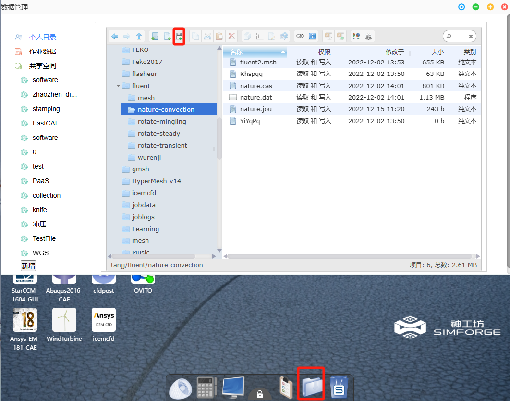

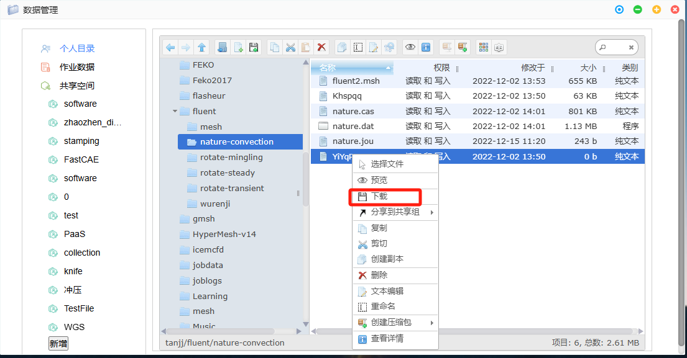

- 方式 2（适合大型文件）

可通过 ftp 公网传输

1. 使用任意客户端（FileZilla、WinScp、Xftp 等）

2. 网络连接地址：ftp. hpc. simforge. cn

3. 网络连接端口：21

4. 连接用户名：神工坊账号、密码

*注 1：FileZilla 下载地址:https://www.filezilla.cn/download*

*注 2：WinScp 下载地址:https://winscp.net/eng/download.php*

### 1.3 作业管理

 **注意** :

> 1. 可查询所有作业的状态，输出，作业信息，以及对作业进行停止操作
> 2. 作业状态显示为'正常结束'，或者'退出或以非 0 退出码结束' 作业则停止计费
> 3. 等待中作业不计费

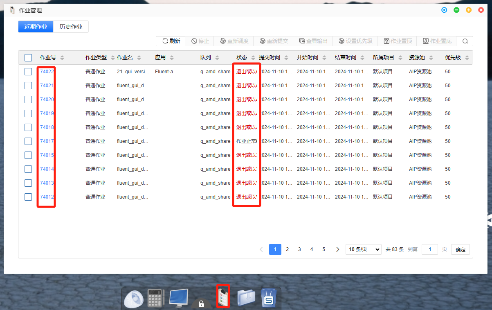

### 1.4 新应用申请

如需添加额外软件，需提交申请至管理员，审核通过后方可添加

### 1.5 计费

所有作业的计费，都是从其提交作业的一刻开始，直至作业自动停止，或者手动停止结束
# 2. 图形化（以 Fluent 为例）

##  2.1 q_x 86_sf 和 q_x 86_sf_expr 队列

 **注意** :

> 1. 提交总核心数= 使用节点个数 \* 每个节点的核心数 
> 2. 每个节点的核心数可自定义 （1-128） 之间

### 2.1.1 提交参数设置

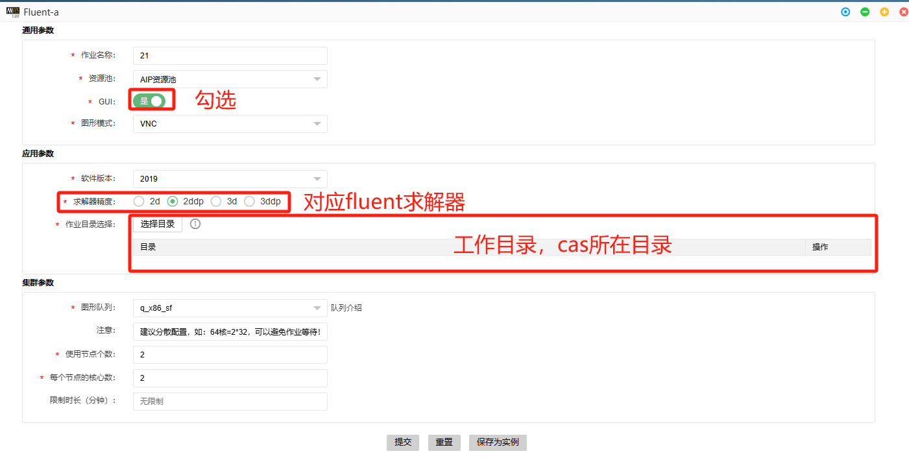

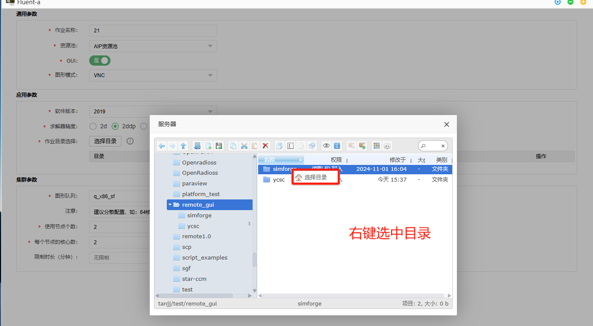

### 2.1.2 进入图形界面
- 方式 1

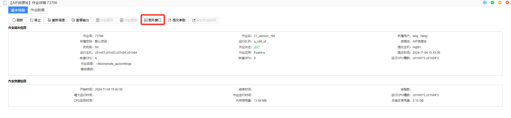

- 方式 2

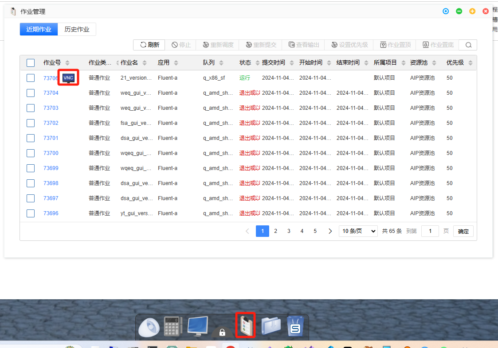

- 软件界面使用与常规一致

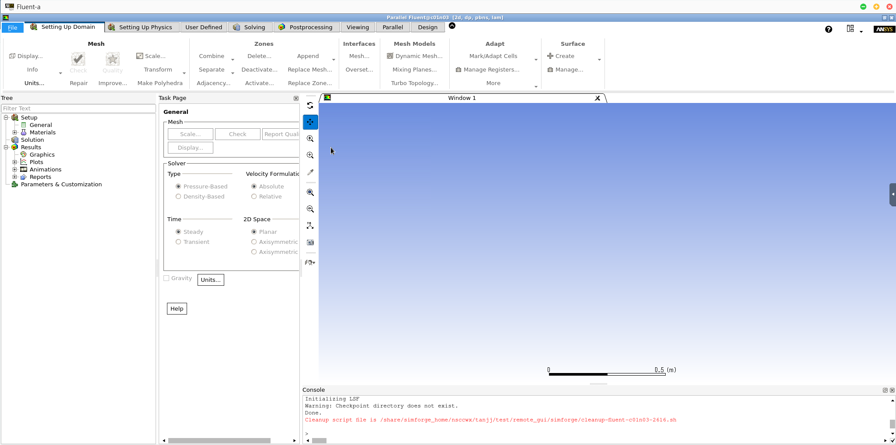

### 2.1.3 停止作业

- 方式 1

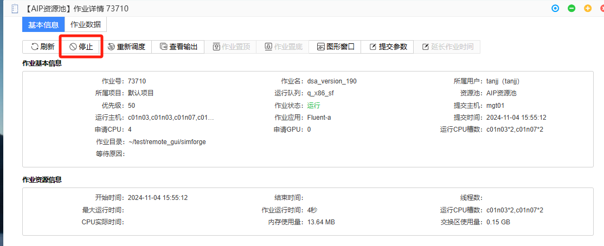

- 方式 2

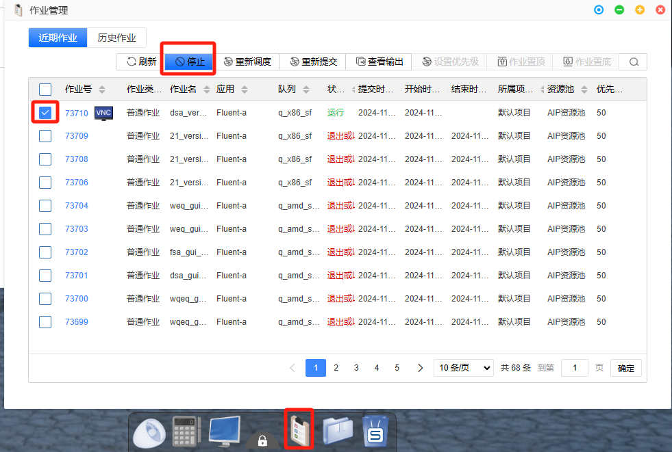

- 错误方式 

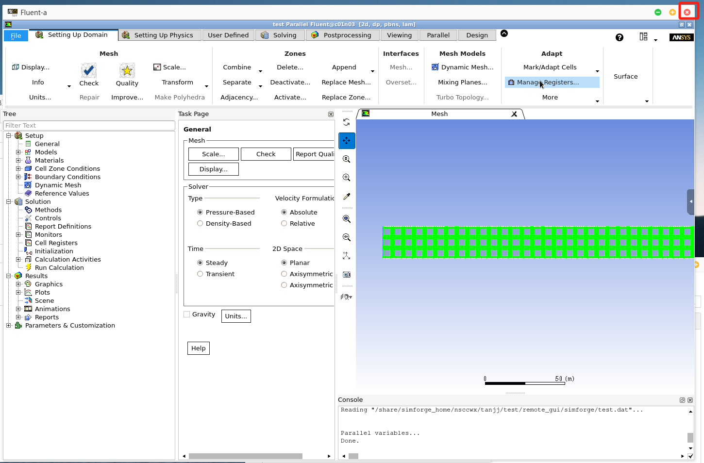

 **注意** :

> 仅×掉右上角外侧按钮只是退出窗口，不会结束图形作业!!!

## 2.2 q_amd_share 队列

 **注意** :

> 1. 提交总核心数= 使用节点个数 \* 每个节点的核心数 
> 2. 每个节点的核心数不可自定义 （默认 128） 
> 3. 该队列使用，建议单个计算文件，新建一个文件夹进行提交计算
> 4. 若文件夹下数据较大，提交后需要一定的载入时间
> 5. 计算结束后，数据后台回载也需一定时间
> 6. 计算完保存至与工作路径一致的目录下

### 2.2.1 提交参数设置

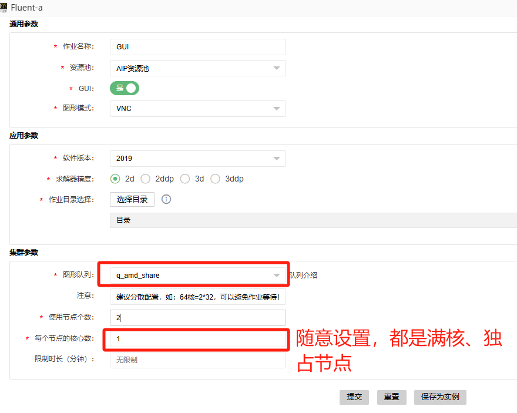 

### 2.2.2 进入图形界面

-  直接点击链接或者图形窗口进入图形界面

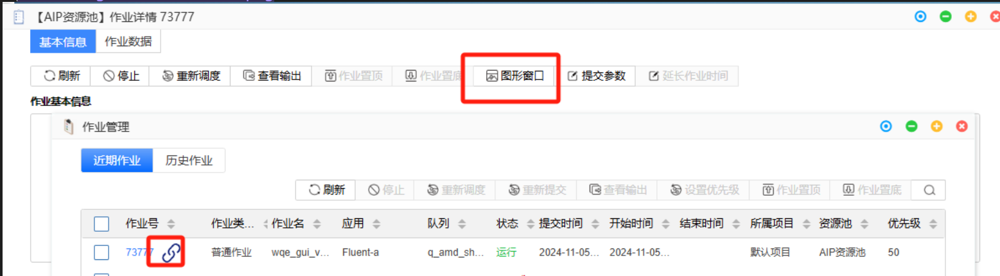

- 如出现此界面，请耐心等待界面连接

- 软件图形设置

	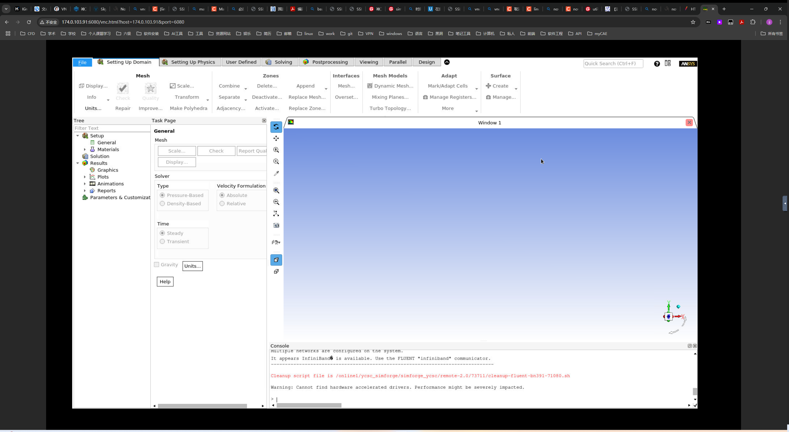

- 窗口自适应调整

  - 已上线自适应功能，如效果不理想，可使用浏览器缩放功能

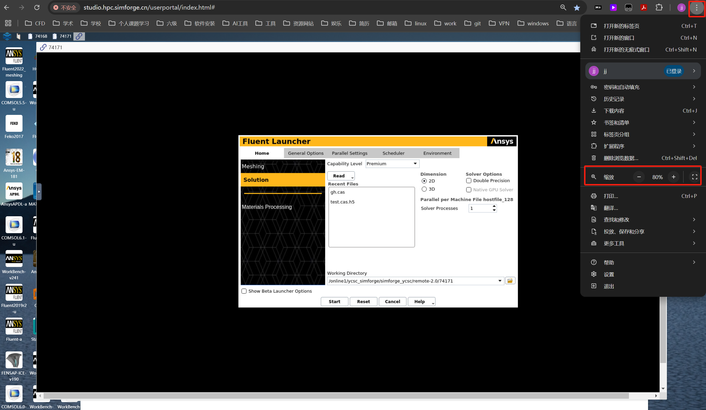

### 2.2.3 停止作业

- 方式 1 

	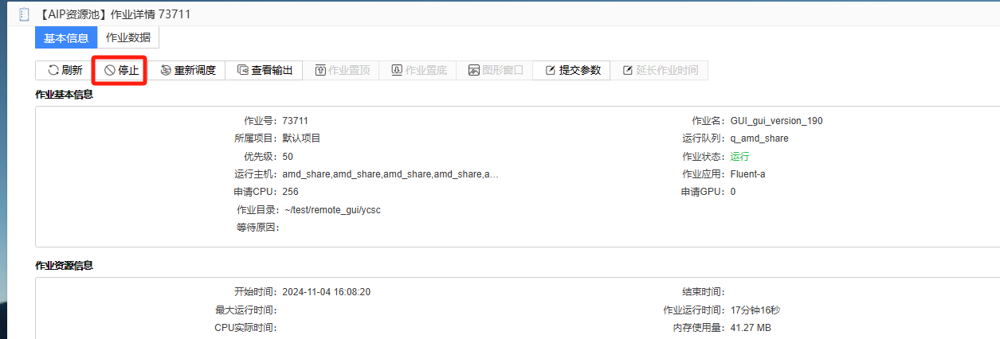

- 方式 2

	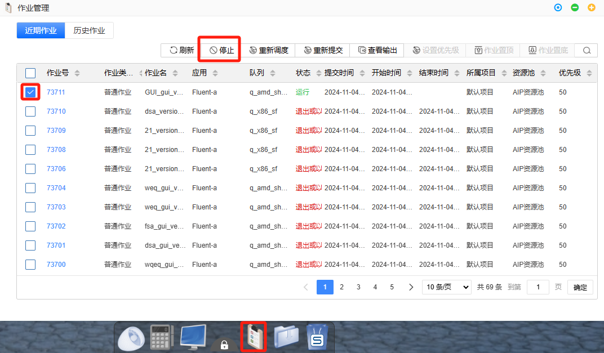

 **注意** :

> 1.  作业计费时间段：从点击提交作业开始（作业状态显示运行即开始计费）至点击停止左右结束后（作业状态显示为''正常结束'，或者'退出或以非 0 退出码结束'即停止计费）
> 2. 作业状态显示为等待时，不计费